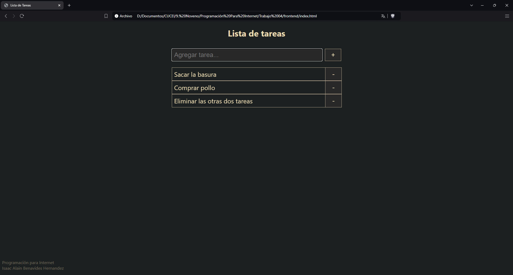
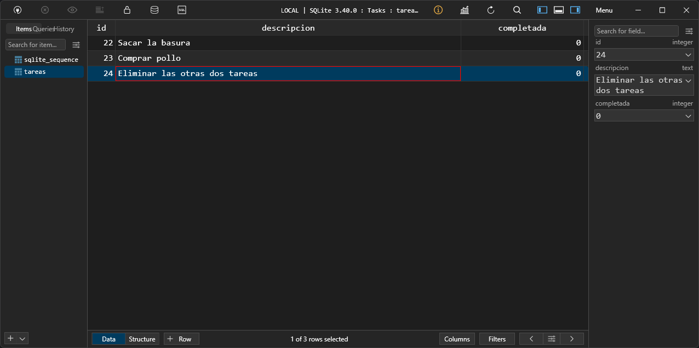
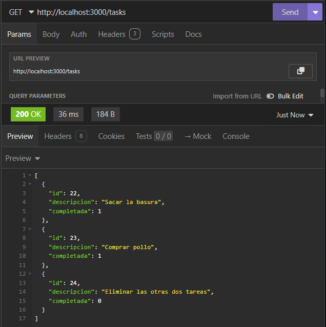
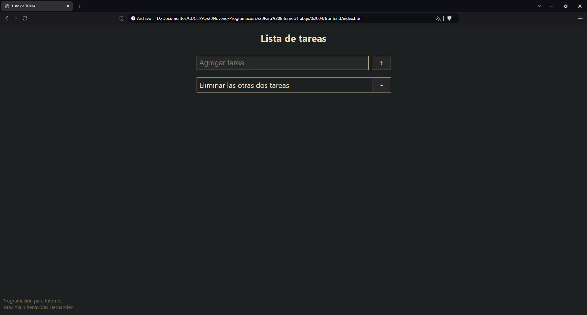
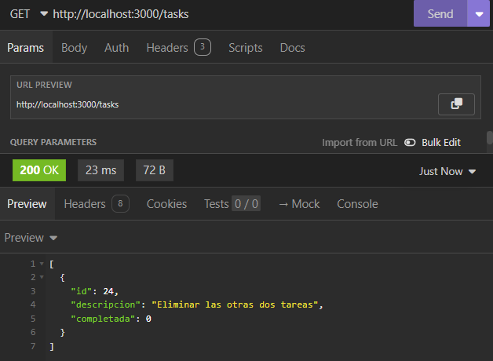

# Lista de Tareas
## Trabajo 04 - Agregar Almacenamiento en SQLite

Programacion para Internet

### Alumno
Isaac Alain Benavides Hernandez

**Código:** 216817953

> [!NOTE]  
> Debido a que no tengo un servidor para correr el backend, no subí esta practica a Github Pages.

#### Instrucciones de ejecución
##### Para Backend
1. Instalar NodeJS.
2. Entrar a la carpeta `backend`.
3. Ejecutar el comando `npm run dev` o el comando `node src/app.js`.

##### Para Frontend
1. Entrar a la carpeta `frontend`.
2. Abrir el archivo `index.html` en el navegador.

#### Funcionamiento
Al igual que en la practica anterior, se pueden agregar tareas, sin embargo, estas no se respaldan en localStorage, se mandan al backend utilizando una solicitud `POST` a la ruta `http://localhost:3000/tasks`.



Si revisamos nuestro backend, podremos ver como estas tareas agregadas desde el formulario del frontend, estan guardadas en la base de datos, podemos revisar esto haciendo una solicitud `GET` a la ruta `http://localhost:3000/tasks`.


Si revisamos el contenido de la base de datos, podremos ver estas tareas guardadas.



Tambien, se pueden marcar tareas como completadas dando click en el texto de la tarea. Las tareas completadas son modificadas en la base de datos utilizando una solicitud `PATCH` a la ruta `http://localhost:3000/tasks/:id`.


Si revisamos el backend, podremos ver que la propiedad completada de cada tarea marcada completada paso de 0 a 1.


Al igual que en la practica anterior, se pueden eliminar tareas, al momento de hacer click en el boton "-" de la tarea, se envia una solicitud `DELETE` a la ruta `http://localhost:3000/tasks/:id` para eliminar dicha tarea de la base de datos.



Si volvemos a revisar el backend haciendo una solicitud `GET` a la ruta `http://localhost:3000/tasks`, podremos ver que solo queda una tarea en la base de datos.




#### Estructura de la API REST
```
|--> /        GET
|--> /tasks
    |--> /    GET
    |--> /    POST
    |--> /:id GET
    |--> /:id PATCH
    |--> /:id DELETE
```
